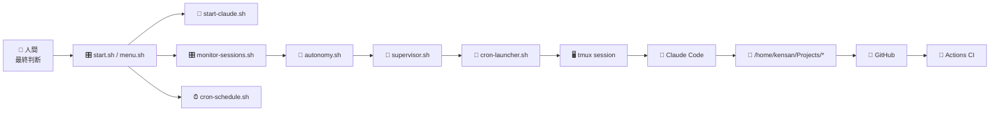
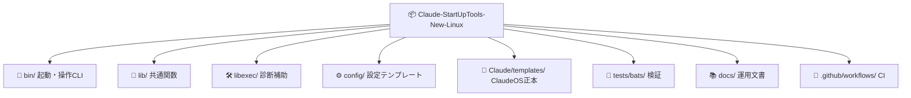
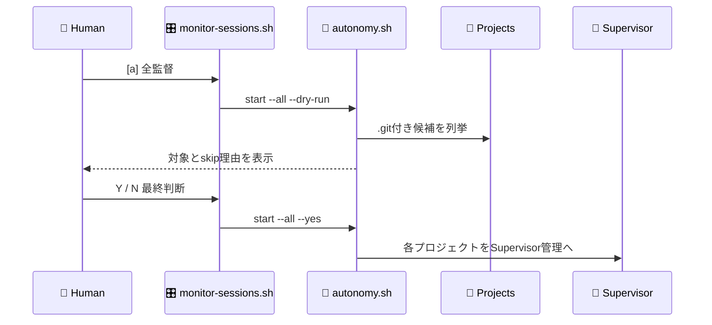
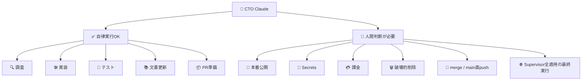
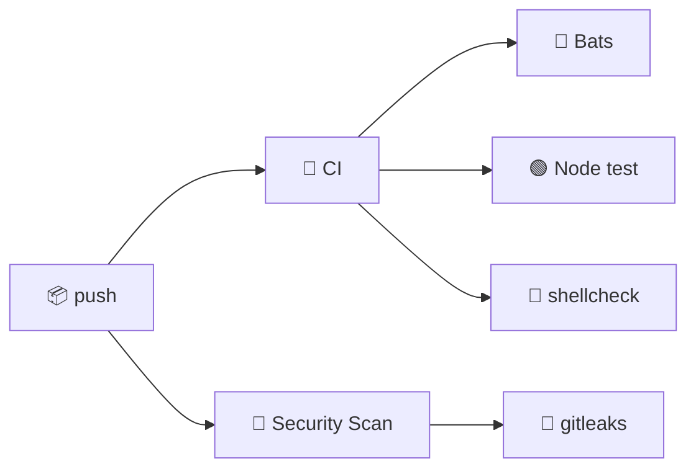

# 🚀 Claude-StartUpTools-New-Linux

Linux ローカルで Claude Code を起動し、`/home/kensan/Projects` 配下の Git リポジトリを自律開発対象として管理するスタートアップツールです。
SSH 接続や Windows/PowerShell 経路は持たず、`tmux`、Supervisor、cron、GitHub Actions を Linux 上で扱います。

```text
🎛️ Menu       🧠 CTO Claude       🔁 Supervisor       🧪 CI
   │              │                    │                │
   ├─ L1/S1 ─────▶│ 1セッション起動     │                │
   ├─ MO ─────────┼───────────────────▶│ 監視/再開管理   │
   └─ Tests ──────┴────────────────────┴───────────────▶│
```

## ✨ 何をするツールか

| アイコン | 機能 | 内容 |
|---|---|---|
| 🐧 | Linux専用 | ローカルの `claude` / `tmux` / `cron` / `systemd` を使用 |
| 📂 | Project候補検出 | `/home/kensan/Projects` 配下の `.git` 付きディレクトリを候補化 |
| 🎛️ | コントロールセンター | セッション監視、介入、起動、停止、登録削除を1画面で操作 |
| 🔁 | Supervisor | Goal到達・Blocked・上限到達まで自律再開 |
| 🔢 | 数字付き選択 | 個別プロジェクトを番号で選んで管理 |
| 🌐 | 全適用 | 全登録候補へ Supervisor 適用。実行前に人間確認 |
| 🧠 | CTO委任 | 実装・検証・レビューはClaudeへ委任 |
| 🧍 | 人間最終判断 | 公開、merge、Secrets、破壊的操作は人間が選択 |
| 🧪 | 自動検証 | Bats、Node test、shellcheck、GitHub Actions |

## 🧭 全体アーキテクチャ



## 🗂️ ディレクトリ構成



## ⚡ クイックスタート

```bash
cp config/config.json.template config/config.json
./start.sh
```

| キー | アイコン | 動作 |
|---|---|---|
| `L1` | 🖥️ | Claude をフォアグラウンド起動 |
| `S1` | 🌙 | Claude をバックグラウンド自律起動 |
| `MO` | 🎛️ | コントロールセンターを開く |
| `15` | 📺 | セッション監視を開く |
| `14` | ⏰ | cron登録・編集・削除 |

## 🎛️ コントロールセンター

```bash
bash bin/monitor-sessions.sh open
```

```text
🎛️ ClaudeOS コントロールセンター
────────────────────────────────────────────────────────
🟢 実行中セッション      #  プロジェクト     経過    残り
🟢 登録 / supervisor     #  プロジェクト     tmux   supervisor
────────────────────────────────────────────────────────
[1-9]介入  [n]新規追加  [a]全監督  [l]起動  [s]監督開始
[x]監督停止 [d]登録削除 [q]終了
```

| キー | アイコン | 操作 | 検証方針 |
|---|---|---|---|
| `1`-`9` | 🎯 | 実行中セッションへ介入 | tmux window選択を検証 |
| `n` | 🆕 | 全プロジェクトから個別追加 | 候補列挙・状態バッジを検証 |
| `a` | 🌐 | Supervisor全適用 | dry-run後に人間確認Yで実行する経路を検証 |
| `l` | ▶️ | 1回だけBG起動 | cron launcher呼び出しと起動確認を検証 |
| `s` | 🔁 | Supervisor開始 | cron削除確認とSupervisor起動を検証 |
| `x` | 🛑 | Supervisor停止 | stop flag生成を検証 |
| `d` | 🗑️ | 登録削除 | cron/state/tmux削除を検証 |
| `q` | 🚪 | 終了 | dashboard loop終了 |

## 🔁 Supervisor全適用



事前確認:

```bash
bash bin/autonomy.sh start --all --dry-run
```

人間確認後の実行:

```bash
bash bin/autonomy.sh start --all --yes
```

安全のため、既定では次を skip します。

| アイコン | skip対象 |
|---|---|
| 🔁 | 既にSupervisor稼働中 |
| ⏰ | cron登録が残っている |
| 🧰 | このランチャー自身 |

## 🔔 監視・通知（Heartbeat Watchdog）

Claude Code プロセスの **沈黙 3 類型**を自動検知して Webhook 通知する仕組みを内蔵しています。

| 種別 | 原因 | 担当フック | 通知イベント |
|---|---|---|---|
| type1 | API エラー・ツール失敗 | `stop-failure-gate.js` | `api_failure` |
| type2 | 入力待ち沈黙 | `notification-gate.js` | `input_waiting` |
| **type3** | **SIGKILL / OOM / 再起動** | **`heartbeat-watchdog.js`** | **`api_failure`** |

### type3: Heartbeat Watchdog のしくみ

```
SessionStart
  └─ heartbeat-writer.js (SessionStart フック)
       └─ detached spawn
            └─ heartbeat-daemon.js (常駐デーモン)
                  │ 60 秒ごとに heartbeat.json を更新
                  ▼
         heartbeat-watchdog.js (外部 cron: 5 分ごと)
                  │ last_beat が閾値超過
                  ▼
         webhook-notifier.js → Teams / Slack / HTTPS
```

### 有効化手順

**1. state.json に webhook を設定する**

```json
{
  "webhook": {
    "enabled": true,
    "events": { "api_failure": true }
  }
}
```

**2. 環境変数を設定する**

```bash
export TEAMS_WEBHOOK_URL="https://xxxxx.webhook.office.com/webhookb2/..."
# または
export HTTPS_WEBHOOK_URL="https://your-endpoint.example.com/webhook"
```

**3. cron を登録する**

```bash
mkdir -p ~/.claudeos/logs
# crontab -e で追加:
*/5 * * * * cd /home/kensan/Projects/YOUR_PROJECT && \
  TEAMS_WEBHOOK_URL="$TEAMS_WEBHOOK_URL" \
  node .claude/claudeos/scripts/hooks/heartbeat-watchdog.js \
  >> ~/.claudeos/logs/heartbeat-watchdog-YOUR_PROJECT.log 2>&1
```

> 詳細手順: [`docs/claude/08_heartbeat-watchdog-cron設定手順.md`](docs/claude/08_heartbeat-watchdog-cron設定手順.md)

## 🧠 CTO自律開発の境界



## 🧪 検証

```bash
npm test
npm run lint
bash bin/autonomy.sh start --all --dry-run
```

| アイコン | コマンド | 確認内容 |
|---|---|---|
| 🧪 | `npm test` | Bats + Node test |
| 🧹 | `npm run lint` | shellcheck |
| 🌐 | `start --all --dry-run` | 全適用対象とskip理由 |
| 🎛️ | `monitor-sessions.bats` | 操作キー、色、表示残骸防止 |
| 🔐 | Security Scan | gitleaks |

## 🎨 表示ポリシー

運用メニューとコントロールセンターは、灰色表示を使いません。

| 用途 | 色 |
|---|---|
| 見出し・罫線 | 🟦 シアン |
| 正常・稼働 | 🟩 緑 |
| 選択・注意 | 🟨 黄 |
| 異常・停止 | 🟥 赤 |
| 補助カテゴリ | 🟪 マゼンタ |

## 🚫 対象外

| アイコン | 対象外 |
|---|---|
| 🔌 | SSH接続 |
| 🪟 | Windows起動経路 |
| 📜 | PowerShell/Pester |
| 🌉 | PTY bridge |
| 📤 | リモート配布 |

## 🐙 GitHub / CI



Repository:

```text
https://github.com/Kensan196948G/Claude-StartUpTools-New-Linux
```
