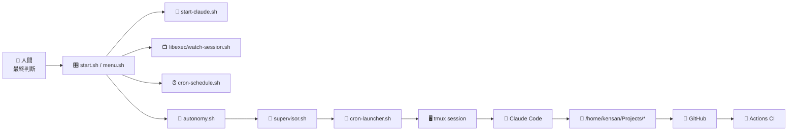
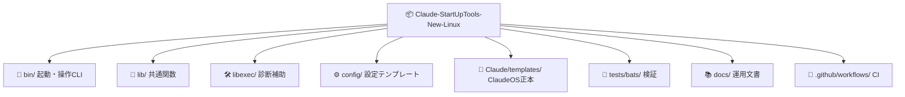
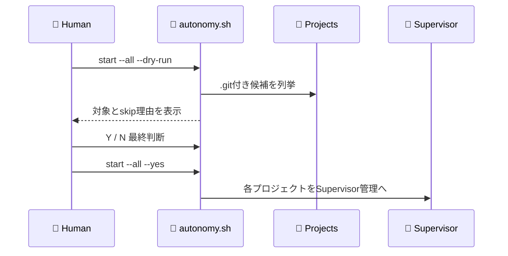
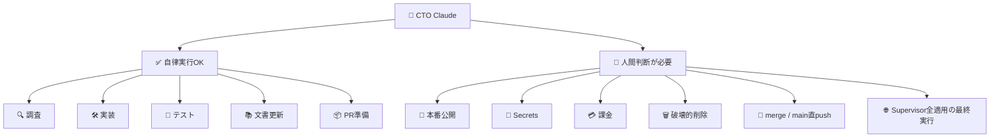
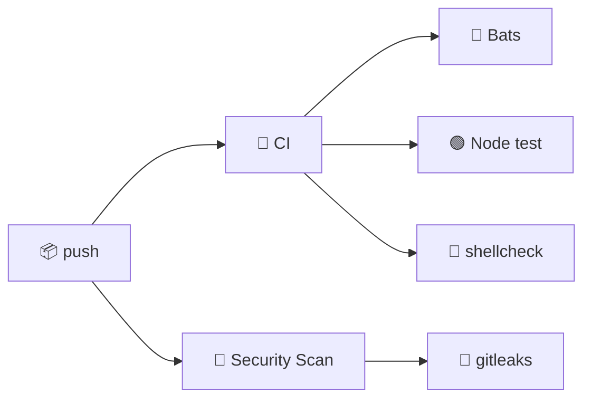

# 🚀 Claude-StartUpTools-New-Linux

Linux ローカルで Claude Code を起動し、`/home/kensan/Projects` 配下の Git リポジトリを自律開発対象として管理するスタートアップツールです。
SSH 接続や Windows/PowerShell 経路は持たず、`tmux`、Supervisor、cron、GitHub Actions を Linux 上で扱います。

| 項目 | 値 |
|---|---|
| バージョン | **4.0.0-linux** |
| Agents | **43体** |
| ClaudeOS カーネル | **43体+44コマンド** |

```text
🎛️ Menu       🧠 CTO Claude       🔁 Supervisor       🧪 CI
   │              │                    │                │
   ├─ L1/S1 ─────▶│ 1セッション起動     │                │
   ├─ 14/15 ──────┼───────────────────▶│ cron/監視/再開  │
   └─ Tests ──────┴────────────────────┴───────────────▶│
```

## ✨ 何をするツールか

| アイコン | 機能 | 内容 |
|---|---|---|
| 🐧 | Linux専用 | ローカルの `claude` / `tmux` / `cron` / `systemd` を使用 |
| 📂 | Project候補検出 | `/home/kensan/Projects` 配下の `.git` 付きディレクトリを候補化 |
| 📺 | セッション状態監視 | 実行中 `claudeos-*` セッションの稼働・経過・残り時間を一覧表示 |
| 🔁 | Supervisor | Goal到達・Blocked・上限到達まで自律再開 |
| 🔢 | 数字付き選択 | 個別プロジェクトを番号で選んで管理 |
| 🌐 | 全適用 | 全登録候補へ Supervisor 適用。実行前に人間確認 |
| 🧠 | CTO委任 | 実装・検証・レビューはClaudeへ委任 |
| 🧍 | 人間最終判断 | 公開、merge、Secrets、破壊的操作は人間が選択 |
| 🧪 | 自動検証 | Bats、Node test、shellcheck、GitHub Actions |

## 🧭 全体アーキテクチャ



## 🗂️ ディレクトリ構成



## ⚡ クイックスタート

```bash
cp config/config.json.template config/config.json
./start.sh
```

| キー | アイコン | 動作 |
|---|---|---|
| `L1` | 🖥️ | Claude をフォアグラウンド起動（既定 無制限。`supervisor.defaults.foregroundSessionMinutes` で分数指定可） |
| `S1` | 🌙 | Claude をバックグラウンド自律起動（既定 5h 上限） |
| — | 🎯 | どちらも起動時に **Goal Router** が Primary / Specialized Goal を自動判定（`bin/start-claude.sh --project P --foreground --goal auto\|<name> --intent "<要求>"` で手動 override） |
| `15` | 📺 | セッション状態監視を開く |
| `14` | ⏰ | cron登録・編集・削除 |

## 📺 セッション状態監視

実行中の `claudeos-*` セッションを一覧し、経過・残り時間を確認します（メニュー項15）。

```bash
bash libexec/watch-session.sh
```

セッションへ直接接続して中身を確認・介入する場合は `tmux` を使います。

```bash
tmux ls | grep claudeos-           # 実行中セッション一覧
tmux attach -t claudeos-<project>  # 接続（Ctrl-b d でデタッチ=BG継続）
```

起動・停止・Supervisor 適用・登録削除といった操作は、それぞれ運用メニューの専用項目（起動 `L1`/`S1`、cron `14`、Supervisor は `bin/autonomy.sh`）から行います。

## 🔁 Supervisor全適用



事前確認:

```bash
bash bin/autonomy.sh start --all --dry-run
```

人間確認後の実行:

```bash
bash bin/autonomy.sh start --all --yes
```

安全のため、既定では次を skip します。

| アイコン | skip対象 |
|---|---|
| 🔁 | 既にSupervisor稼働中 |
| ⏰ | cron登録が残っている |
| 🧰 | このランチャー自身 |

## 🔔 監視・通知（Heartbeat Watchdog）

Claude Code プロセスの **沈黙 3 類型**を自動検知して Webhook 通知する仕組みを内蔵しています。

| 種別 | 原因 | 担当フック | 通知イベント |
|---|---|---|---|
| type1 | API エラー・ツール失敗 | `stop-failure-gate.js` | `api_failure` |
| type2 | 入力待ち沈黙 | `notification-gate.js` | `input_waiting` |
| **type3** | **SIGKILL / OOM / 再起動** | **`heartbeat-watchdog.js`** | **`api_failure`** |

### type3: Heartbeat Watchdog のしくみ

```
SessionStart
  └─ heartbeat-writer.js (SessionStart フック)
       └─ detached spawn
            └─ heartbeat-daemon.js (常駐デーモン)
                  │ 60 秒ごとに heartbeat.json を更新
                  ▼
         heartbeat-watchdog.js (外部 cron: 5 分ごと)
                  │ last_beat が閾値超過
                  ▼
         webhook-notifier.js → Teams / Slack / HTTPS
```

### 有効化手順

**1. state.json に webhook を設定する**

```json
{
  "webhook": {
    "enabled": true,
    "events": { "api_failure": true }
  }
}
```

**2. 環境変数を設定する**

```bash
export TEAMS_WEBHOOK_URL="https://xxxxx.webhook.office.com/webhookb2/..."
# または
export HTTPS_WEBHOOK_URL="https://your-endpoint.example.com/webhook"
```

**3. cron を登録する**

```bash
mkdir -p ~/.claudeos/logs
# crontab -e で追加:
*/5 * * * * cd /home/kensan/Projects/YOUR_PROJECT && \
  TEAMS_WEBHOOK_URL="$TEAMS_WEBHOOK_URL" \
  node .claude/claudeos/scripts/hooks/heartbeat-watchdog.js \
  >> ~/.claudeos/logs/heartbeat-watchdog-YOUR_PROJECT.log 2>&1
```

> 詳細手順: [`docs/claude/08_heartbeat-watchdog-cron設定手順.md`](docs/claude/08_heartbeat-watchdog-cron設定手順.md)

## 🧠 CTO自律開発の境界



## 🎯 統合 Goal Router（Native Goal Routing）

起動経路（L1 / S1 / T1 / cron / headless / Supervisor）はすべて `lib/goal-router.sh` の同じ判定を通り、
**Project 状態 + Repository Evidence + ユーザー要求 → Primary Goal → Specialized Goal → effective goal_type → `goals/<type>.md` の /goal 注入** の段階構造で動きます。巨大な万能 /goal は廃止しました。

| Primary Goal | 用途 | Specialized（配下） |
|---|---|---|
| `development` | 既存 Project の通常開発・継続改善 | refactoring / hotfix |
| `mvp-release` | 新規 / Prototype / PoC / MVP | production-release |
| `assessment` | 評価・Readiness・Architecture / Security Review（改善実装まで） | security-emergency |
| `deep-debug` | CI 失敗・Runtime Error・Regression の根本原因解析 | hotfix / security-emergency |
| `product-assurance` | Release 前総合品質保証（DB 復旧・Security・Contract・E2E・性能・A11y） | production-release / safe-auto-merge / pr-babysit |

| 操作 | 方法 |
|---|---|
| 自動判定（既定） | `state.json` の `goal_router.mode=auto`。Security Critical > CI 失敗 > 明示要求 > deploy.ready / Release フェーズ > phase_mode > 旧 `goal_type` > 新規判定の順 |
| 手動 override | メニュー L1/T1/S1 の確認後に「🎯 Goal」「📝 要求」を入力（Enter で自動）。CLI は `bin/start-claude.sh --project P --foreground --goal deep-debug`（manual lock）/ `--goal auto`（解除）/ `--intent "全体を評価して"`（要求を Evidence に） |
| Runtime Evidence | `state.runtime.{health_url,error_log,cloudflare.project\|worker}` を設定すると health down / エラー多発 / Cloudflare deploy failure を deep-debug（+hotfix）へ。未設定は影響なし |
| LLM intent 分類 | キーワード表で判定不能な要求だけ `claude -p --model haiku` で分類（`CLAUDEOS_GOAL_INTENT_LLM=auto\|1\|0`、fail-safe） |
| cron one-shot | `bin/cron-schedule.sh add … --goal-type pr-babysit`（state を lock しない従来互換） |
| 判定の確認 | `bash libexec/goal-router.sh <project> --dry-run [--json] [--explain]`、Mission Control 🧬 v10 パネル |
| Flapping 防止 | session lock 12h（`CLAUDEOS_GOAL_LOCK_MINUTES`）。reroute は Security Critical / 重大 CI 失敗 / deploy.ready・phase_mode 変化 / 新指示 / `--reroute` のみ |
| 無効化 / fallback | `CLAUDEOS_GOAL_ROUTER_DISABLE=1` で従来 `goal_type`。Router 失敗時は explicit → goal_type → phase_mode → mvp-release で必ず起動 |

Human Gate（main 直接 push・本番デプロイ・Secrets・破壊的操作）は Router 導入前と同一です。設計は `docs/architecture/GOAL_ROUTER.md`、運用は `docs/claude/20_統合GoalRouter.md`。

## 🧬 ClaudeOS v10（Native-Agentic Development OS）

原則: **Claude Code Native 機能 > Thin ClaudeOS Adapter > Custom Implementation**。ClaudeOS は AI 機能を再実装せず、Linux 上で Claude Code を安全・長時間・複数プロジェクトで運用する Control Plane に徹します。

| 領域 | v10 での実装 | 入口 |
|---|---|---|
| 🧪 互換性 / Capability Detection | `config/claude-code-compat.json`（minimum 2.1.224 / tested 2.1.263）、`lib/claude-capability.sh` | メニュー `17`、`bash libexec/diag-claude-compat.sh --json` |
| 🐘 Local PostgreSQL 正本（Neon 廃止） | `lib/postgres.sh`、`bin/pg-ops.sh`（init / backup / verify / restore-drill / freshness / migration-risk / status / units）、systemd backup・drill timer | メニュー `18`、`bin/pg-ops.sh status --json` |
| 🤖 Lazy Agent Architecture | `config/agent-catalog.json`（first-class 9 体のみ `.claude/agents` へ）、`scripts/tools/agent-router.js` + golden eval | `/agent-router`、`node scripts/tools/agent-router.js --json` |
| 🧠 Context Engineering | CLAUDE.md 62 行 + `.claude/rules/`（path-scoped）+ 実 skill 8 本 + `.claude/claudeos/policy/` | `/doctor`、`/skill-doctor` |
| 🔧 Hooks / 権限 | `${CLAUDE_PROJECT_DIR}` 絶対パス、Stop async、deny 強化、`--permission-mode auto --permission-prompts none` | `node --test scripts/hooks-settings.test.js` |
| 🔁 Self-Improvement / SDLC | `/improver`、`/sdlc-scale`、`.claude/claudeos/sdlc/*.md`、`tests/evals/` | `docs/architecture/SELF_IMPROVEMENT_ARCHITECTURE.md` |
| 🎛️ Mission Control | 🧬 v10 Platform パネル（PostgreSQL / Capability / native agents / routing / hooks） | `/api/v10` |

設計・移行記録: `docs/architecture/ARCHITECTURE_V10.md` / `MIGRATION_V9_TO_V10.md` / `CURRENT_ARCHITECTURE.md` ほか（`docs/architecture/`）。

## 🚧 ClaudeOS v11 移行（Managed-Agent Native Architecture、進行中）

Claude Managed Agents を **Autonomous Execution Plane** とする移行を P0（実行基盤）から段階的に進めています。

| 領域 | P0 での実装 | 入口 |
|---|---|---|
| 🏗️ 実行設定契約 | `config/managed-agents.json.template`（`enabled` / `mode=disabled\|dry-run\|live` / budget 契約 / GitHub Repository Resource 主系 + MCP は PR/Issue 限定） | 同テンプレートを `config/managed-agents.json` へコピーして利用 |
| 💰 budget 必須化 | `scripts/tools/managed-session-payload.js` — budget 無し Session 作成は `BUDGET_REQUIRED` で拒否（budget は後付け不可） | `node scripts/tools/managed-session-payload.js session-create --config ...` |
| 🧭 実行 Plane 選択 | Goal Router が `execution_plane=managed\|local` を判定し `state.goal_router.execution_plane` へ記録。契約不成立時は **fail-safe で local** | `lib/goal-router.sh`、`bin/start-claude.sh` 経由で自動適用 |
| 📝 監査 / 状況 | P0 監査（crash 前提再評価・live 検証 Blocker・rollback 手順） | `docs/architecture/audits/2026-09-09-managed-agents-v11-p0.md` |

Thin Adapter（Session/Environment Manager）と Permission Policy Engine は人間判断待ち（HUMAN REVIEW）。live API 検証は NOT RUN（課金人間決裁が必要）。

## 🧪 検証

```bash
npm test
npm run lint
bash bin/autonomy.sh start --all --dry-run
```

| アイコン | コマンド | 確認内容 |
|---|---|---|
| 🧪 | `npm test` | Bats + Node test |
| 🧹 | `npm run lint` | shellcheck |
| 🌐 | `start --all --dry-run` | 全適用対象とskip理由 |
| 🖥️ | `tmux-runner.bats` | セッション起動・命名規則・メタデータ付与 |
| 🔐 | Security Scan | gitleaks |

## 🎨 表示ポリシー

運用メニューとセッション状態監視は、灰色表示を使いません。

| 用途 | 色 |
|---|---|
| 見出し・罫線 | 🟦 シアン |
| 正常・稼働 | 🟩 緑 |
| 選択・注意 | 🟨 黄 |
| 異常・停止 | 🟥 赤 |
| 補助カテゴリ | 🟪 マゼンタ |

## 🚫 対象外

| アイコン | 対象外 |
|---|---|
| 🔌 | SSH接続 |
| 🪟 | Windows起動経路 |
| 📜 | PowerShell/Pester |
| 🌉 | PTY bridge |
| 📤 | リモート配布 |

## 🐙 GitHub / CI



Repository:

```text
https://github.com/Kensan196948G/Claude-StartUpTools-New-Linux
```
